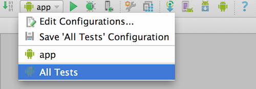

Building    {#games_in_motion_guide_building}
========

Developers can build the game from source for [Android][], using
[Android Studio][].

# Version Requirements

Following are the minimum required versions for the tools and libraries you
need for building [Games in Motion][] for [Android][]:

-   [Android Studio][]: Version 1.0.
-   [Android SDK][]:  Android 4.1 (API Level 16)
-   [Android Support Library][]: v7.21
-   [Google Play Games Services][]: 6.1 or above
-   Install [fplutil prerequisites][] if you would like to build documentation.

# Before Building

-   Install [Android Studio][].
-   Install all required libraries via the Android SDK Manager from within
    [Android Studio][].

## Set up Google Play Games Services

To use the [Google Play Games Services][] features in the game, follow the steps
below to set up [Google Play Games Services][] IDs:

-   Create an App ID with new package name in the
    [Google Play Developer Console][].
    -   Replace `app_id` in `app/build.gradle` with the newly created one.
    -   Update the package name in `app/src/AndroidManifest.xml` and Java source files.
        - For example, rename `com.google.fpl.gim.examplegame` to
          `com.mystudio.coolgame`.
-   Add [Google Play Games Services][] to the App in the
    [Google Play Developer Console][].
-   For testing prior to publishing an APK, in the Game Services sections of the
    [Google Play Developer Console][], add your email account as a tester.

# Building, installing, testing and running the game.

You can use the standard build and run instructions for [Android Studio][].

To build and run the JUnit tests, change the configuration from `app` to
`All Tests`.

\s\s

  [Android]: http://www.android.com
  [Android SDK]: http://developer.android.com/sdk/index.html
  [Android Studio]: http://developer.android.com/tools/studio/index.html
  [Android Support Library]: https://developer.android.com/tools/support-library/features.html
  [fplutil prerequisites]: http://google.github.io/fplutil/fplutil_prerequisites.html
  [Games in Motion]: @ref games_in_motion_guide_overview
  [Google Play Developer Console]: http://play.google.com/apps/publish/
  [Google Play Games Services]: https://developer.android.com/google/play-services/games.html
